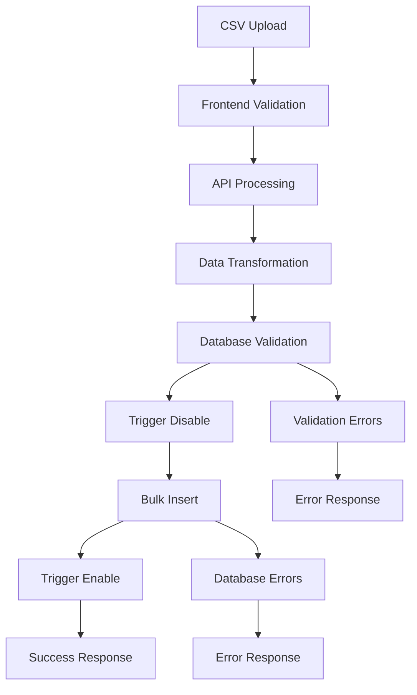

# Contract Import System Documentation

## Overview
The BidFlow platform includes a robust contract import system that handles bulk CSV imports with automatic validation, error handling, and database relationship management.

## System Architecture

### Components
1. **Frontend Import Interface** (`src/app/admin/contracts/import/page.tsx`)
2. **Bulk Import API** (`src/app/api/contracts/bulk-import/route.ts`)
3. **Database Triggers** (PostgreSQL functions and triggers)
4. **EGP Scraper** (`egp_scraper/egp_scraper.py`)

## Import Process Flow



## Key Features

### 1. CSV Validation
- **Line Ending Detection**: Automatically detects and fixes Windows CRLF vs Unix LF issues
- **Data Type Validation**: Ensures required fields are present and properly formatted
- **Duplicate Detection**: Prevents importing contracts with existing reference numbers

### 2. Database Integration
- **Entity Resolution**: Automatically links contracts to existing procuring entities and awardees
- **Relationship Management**: Creates new entities when they don't exist
- **Trigger Management**: Temporarily disables triggers during bulk operations for performance

### 3. Error Handling
- **Detailed Error Messages**: Provides specific row numbers and field names for validation errors
- **Graceful Degradation**: Continues processing even if individual records fail
- **Comprehensive Logging**: Logs all operations for debugging and monitoring

## Database Schema

### Contracts Table
The main contracts table stores all contract information with the following key fields:
- `reference_number` (Primary identifier)
- `title`, `category`, `procurement_method`
- `procuring_entity`, `contact_person`
- `submission_deadline`, `publish_date`
- `status`, `current_stage`, `publish_status`
- `detail_url` (Link to original EGP portal page)

### Related Tables
- **procuring_entities**: Stores government agencies and organizations
- **awardees**: Stores companies and contractors
- **Entity Resolution**: Automatic linking between contracts and entities

## API Endpoints

### POST `/api/contracts/bulk-import`
**Purpose**: Import multiple contracts from CSV data

**Request Body**:
```json
{
  "contracts": [
    {
      "reference_number": "UNBS/NCONS/2025-2026/00021",
      "title": "Contract Title",
      "category": "services",
      "procurement_method": "Open Domestic Bidding",
      "procuring_entity": "Uganda National Bureau of Standards",
      "submission_deadline": "2025-09-23",
      "status": "open",
      "current_stage": "published",
      "publish_status": "draft",
      "detail_url": "https://egpuganda.go.ug/bid/notice/12345/details"
    }
  ]
}
```

**Response**:
```json
{
  "success": 47,
  "failed": 0,
  "errors": [],
  "data": [...]
}
```

## EGP Scraper Integration

### Features
- **Automatic Line Ending Fixes**: Ensures CSV files are compatible with the import system
- **Data Cleaning**: Removes problematic characters and normalizes data
- **Validation Reports**: Generates detailed reports on data quality
- **Agent-Friendly**: Simplified interface for AI agent integration

### Usage
```python
from egp_scraper import EGPScraper

scraper = EGPScraper()
contracts = scraper.scrape_contracts()
scraper.export_to_csv_webapp_ready(contracts, 'output.csv')
```

## Troubleshooting

### Common Issues

#### 1. CSV Parsing Errors
**Symptoms**: "Reference number is required" errors despite data being present
**Cause**: Windows line endings (CRLF) in CSV files
**Solution**: Use the EGP scraper's automatic line ending fixes

#### 2. Database Trigger Errors
**Symptoms**: "column reference is ambiguous" errors
**Cause**: Database trigger function variable naming conflicts
**Solution**: Run the database fix script (`scripts/fix_trigger_simple.sql`)

#### 3. Validation Failures
**Symptoms**: Import fails with validation errors
**Cause**: Missing required fields or invalid data formats
**Solution**: Check the detailed error messages and fix the CSV data

### Debug Mode
Enable detailed logging by checking the browser console and server logs during import operations.

## Performance Considerations

### Bulk Import Optimization
- **Trigger Management**: Temporarily disables database triggers during bulk operations
- **Batch Processing**: Processes all contracts in a single database transaction
- **Memory Management**: Efficiently handles large CSV files

### Scalability
- **Entity Resolution**: Caches entity lookups to avoid duplicate database queries
- **Indexing**: Database indexes on frequently queried fields
- **Connection Pooling**: Efficient database connection management

## Security Considerations

### Data Validation
- **Input Sanitization**: All CSV data is validated and sanitized before database insertion
- **SQL Injection Prevention**: Uses parameterized queries and ORM
- **Access Control**: Import functionality restricted to admin users

### Audit Trail
- **Import Logging**: All import operations are logged with timestamps and user information
- **Data Integrity**: Database constraints ensure data consistency
- **Error Tracking**: Comprehensive error logging for security monitoring

## Future Enhancements

### Planned Features
- **Real-time Import Status**: WebSocket-based progress updates
- **Import Templates**: Predefined CSV templates for different contract types
- **Advanced Validation**: Custom validation rules for specific procurement types
- **Import Scheduling**: Automated imports from external data sources

### Integration Opportunities
- **API Webhooks**: Notify external systems of successful imports
- **Data Synchronization**: Sync with external procurement databases
- **Analytics Integration**: Enhanced reporting on import patterns and success rates
